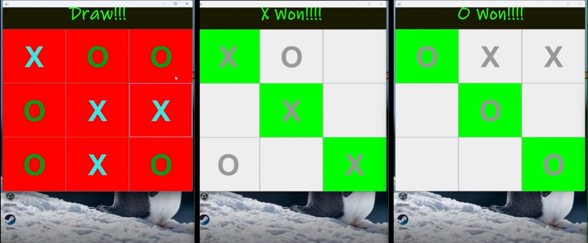

# Tic Tac Toe Game 🎮

This is a **native Java** implementation of the classic **Tic Tac Toe** game. The game features a graphical user interface (GUI) built using `Swing`, offering smooth gameplay with automatic win/draw detection.

---

## 🖼️ Demo
### Gameplay Example:
[](capture/CapMyVid.mp4)
> *Click the image above to watch the gameplay video.*

## ✨ Features

- **Two-player gameplay**: Play with friends using classic Tic Tac Toe rules.
- **GUI built with Swing**: Intuitive interface for quick interactions.
- **Dynamic game logic**: The game checks for winners and draws automatically.
---

## 🚀 How to Run

### Prerequisites
- **Java Development Kit (JDK)** installed (version 8 or higher).

### Clone the Repository
1. Open your terminal and clone the repository:
```bash
git clone https://github.com/Omid2831/Tic-tac-toe.git
```
2. Navigate into the project directory:
```bash
cd Tic-tac-toe
```
### Compile and Run
1. Compile the source files and place the compiled classes in the `bin` directory:
``` bash
javac -d bin *.java
```
3. Run the program:
```bash
java -cp bin main
```
(Please make sure main.java is your program's entry point.)  
---
### 🛠️ File Structure
  <pre>
📂 Tic-tac-toe
 ├── main.java            # Main entry point of the application
 ├── TikTakToe.java       # Game logic and GUI implementation
 ├── main.class           # Compiled bytecode for main
 ├── TikTakToe.class      # Compiled bytecode for game logic
 ├── 📂 capture
 │    ├── CapMyVid.mp4      # Gameplay video
 │    └── pic.png         # Screenshot of the game
    </pre>
---


